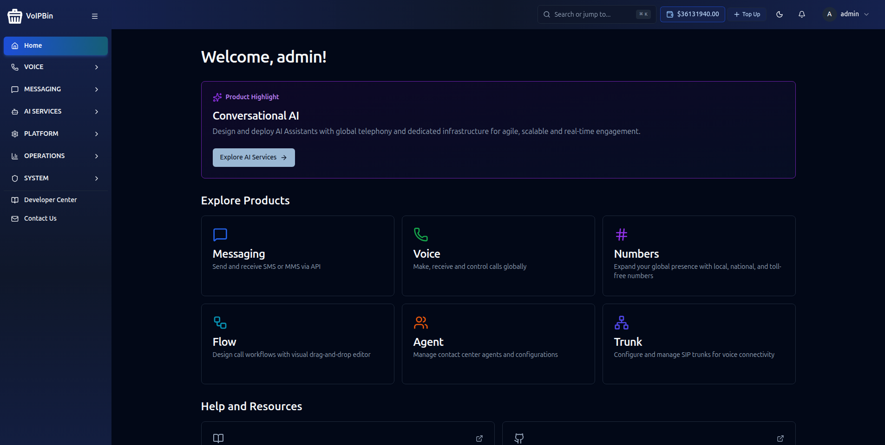
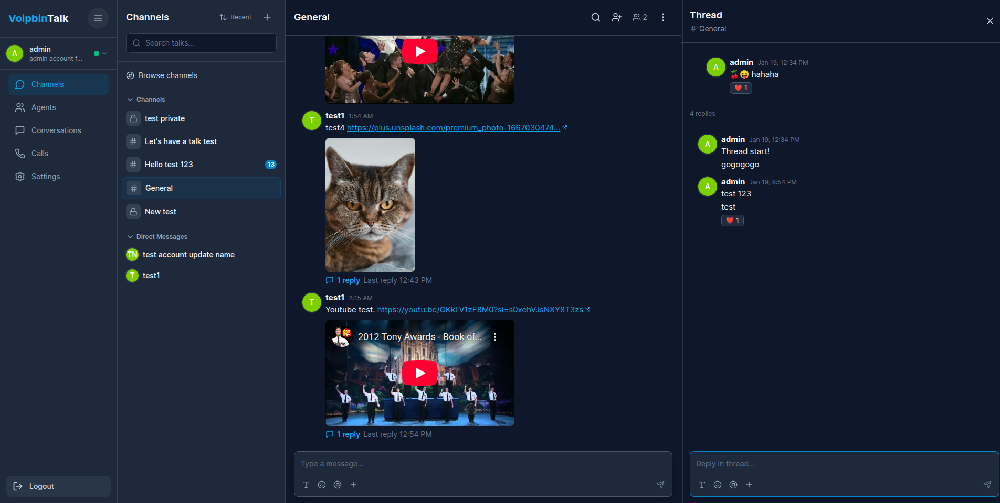

# VoIPBin Sandbox

```
          ████████          
   ██████████████████████    __     __   ___ ____  ____  _
  ██                    ██   \ \   / /__|_ _|  _ \| __ )(_)_ __
 ██████████████████████████   \ \ / / _ \| || |_) |  _ \| | '_ \
 ██                      ██    \ V / (_) | ||  __/| |_) | | | | |
  ██    ██   ██   ██    ██      \_/ \___/___|_|   |____/|_|_| |_|
  ██    ██   ██   ██    ██          Connect & Collaborate for all
  ██    ██   ██   ██    ██                S A N D B O X
  ██    ██   ██   ██    ██  
   ██   ██   ██   ██   ██   
   ██████████████████████   
```

**Your Private AI-Powered CPaaS Laboratory** — A complete Docker Compose environment for building AI voice agents and communications applications. Deploy 25+ microservices with built-in AI capabilities: real-time speech-to-text, text-to-speech, LLM-powered conversations, and programmable voice workflows.

### Why VoIPBin Sandbox?

- **AI Voice Agents** — Build conversational AI agents with OpenAI, Deepgram, ElevenLabs, and Cartesia
- **Real-time Transcription** — Live speech-to-text during calls with AWS Transcribe or Google Speech
- **Text-to-Speech** — Natural voice synthesis with multiple provider support
- **Programmable Voice** — Visual flow builder for IVR, call routing, and automation
- **Full VoIP Stack** — Production-grade SIP proxy, media servers, and conferencing
- **Web Applications** — Admin console, agent team messenger (Talk), and voice conferencing (Meet)

---

## Table of Contents

- [Quick Start](#quick-start)
- [Web Applications](#web-applications)
- [Technical Architecture](#technical-architecture)
- [Prerequisites](#prerequisites)
- [Networking & DNS](#networking--dns)
- [SSL Certificate Trust](#ssl-certificate-trust)
- [The Interactive CLI](#the-interactive-cli)
- [AI Voice Agents](#ai-voice-agents)
- [Developer's Playground](#developers-playground)
- [Service Reference](#service-reference)
- [Troubleshooting](#troubleshooting)

---

## Quick Start

```bash
# Clone the repository
git clone https://github.com/voipbin/sandbox.git
cd sandbox
```

### Getting Started

```bash
sudo ./voipbin
```

This launches the **interactive CLI**. From there:

```
voipbin> init      # First time only: generate .env and certificates
voipbin> start     # Start all 25+ services
```

Or run commands directly:

```bash
sudo ./voipbin init    # Initialize environment
sudo ./voipbin start   # Start all services
```

The `start` command handles **everything** after initialization:

1. Generates `.env` with auto-detected network settings
2. Creates SSL certificates (browser-trusted if mkcert installed)
3. Starts infrastructure (MySQL, Redis, RabbitMQ, CoreDNS)
4. Runs database migrations
5. Configures DNS resolution for `*.voipbin.test`
6. Sets up VoIP network interfaces
7. Starts all 25+ microservices
8. Creates test account and extensions

### What Gets Created

| Resource | Value |
|----------|-------|
| **Admin Account** | `admin@localhost` / `admin@localhost` |
| **Extension 1000** | Password: `pass1000` |
| **Extension 2000** | Password: `pass2000` |
| **Extension 3000** | Password: `pass3000` |
| **Initial Balance** | $100,000.00 |

### Interactive Shell Features

The CLI provides a powerful interactive environment:

- **Tab Completion** — Auto-complete commands and service names
- **Command History** — Use arrow keys to navigate previous commands
- **Context Modes** — Enter `ast`, `kam`, `db`, or `api` for specialized shells

```
voipbin> ast                        # Enter Asterisk context
voipbin(asterisk)> pjsip show endpoints
voipbin(asterisk)> exit             # Return to main shell

voipbin> api                        # Enter API context
voipbin(api)> login admin@localhost
voipbin(api)> get /v1.0/extensions
```

---

## Web Applications

VoIPBin Sandbox includes three web applications for managing and using the platform.

### Admin Console

**URL:** http://admin.voipbin.test:3003



The Admin Console is your central management hub:
- Manage customers, extensions, and agents
- Visual flow builder for IVR and call routing
- Real-time call monitoring and analytics
- Billing and usage tracking

### Talk (Agent Team Messenger)

**URL:** http://talk.voipbin.test:3005



Talk is a team collaboration platform for agents:
- Real-time messaging and team chat
- Integrated voice calling with WebRTC
- Agent presence and availability status
- Call history and conversation tracking

### Meet (Voice Conferencing)

**URL:** http://meet.voipbin.test:3004


Meet provides simple voice conferencing:
- Join audio conference rooms via browser
- WebRTC-powered for easy access
- Dial-in via SIP supported

**Default Credentials:** `admin@localhost` / `admin@localhost`

---

## Technical Architecture

VoIPBin Sandbox orchestrates a microservices architecture with four core layers:

| Layer | Components | Purpose |
|-------|------------|---------|
| **AI Engine** | Pipecat, AI Manager, Transcribe, TTS | Voice AI agents, real-time STT/TTS, LLM integration |
| **SIP Edge** | Kamailio, RTPEngine | SIP signaling proxy, RTP media relay, NAT traversal |
| **Media Servers** | Asterisk (Call, Registrar, Conference) | Call handling, SIP registration, conferencing |
| **API & Managers** | 20+ backend services | REST API, call routing, billing, workflows |

### Technology Stack

| Category | Technology |
|----------|------------|
| **AI/LLM** | OpenAI GPT, Pipecat Framework |
| **Speech-to-Text** | Deepgram, AWS Transcribe, Google Speech |
| **Text-to-Speech** | ElevenLabs, Cartesia, AWS Polly |
| SIP Proxy | Kamailio 5.x |
| Media Server | Asterisk 20.x |
| RTP Proxy | RTPEngine |
| Database | MySQL 8.0 |
| Message Queue | RabbitMQ 3.x |
| Cache | Redis |
| Frontend | React (Admin, Talk, Meet) |

### Network Topology

```
                    ┌─────────────────────────────────────────┐
                    │           External Network              │
                    │  HOST_IP:8443 (API)  KAMAILIO_IP:5060   │
                    └────────────┬───────────────┬────────────┘
                                 │               │
                    ┌────────────▼───────────────▼────────────┐
                    │         Docker Host (Linux/macOS)       │
                    │  ┌─────────────────────────────────────┐│
                    │  │   CoreDNS (*.voipbin.test → IPs)    ││
                    │  └─────────────────────────────────────┘│
                    │                                         │
                    │  ┌──────────┐  ┌──────────┐  ┌────────┐ │
                    │  │ Kamailio │  │RTPEngine │  │  API   │ │
                    │  │ (host)   │  │  (host)  │  │Manager │ │
                    │  └────┬─────┘  └────┬─────┘  └────────┘ │
                    │       │             │                   │
                    │  ┌────▼─────────────▼────────────────┐  │
                    │  │     Docker Network (10.100.0.0/16)│  │
                    │  │  ┌─────────┐ ┌─────────┐ ┌──────┐ │  │
                    │  │  │Asterisk │ │Asterisk │ │ 20+  │ │  │
                    │  │  │  Call   │ │Registrar│ │Mgrs  │ │  │
                    │  │  └─────────┘ └─────────┘ └──────┘ │  │
                    │  └───────────────────────────────────┘  │
                    └─────────────────────────────────────────┘
```

---

## Prerequisites

### Ubuntu/Debian

```bash
# Docker & Docker Compose
sudo apt update && sudo apt install -y docker.io docker-compose-v2
sudo usermod -aG docker $USER && newgrp docker

# Python dependencies (for database migrations)
pip3 install alembic mysqlclient PyMySQL

# mkcert (for browser-trusted SSL certificates)
sudo apt install -y mkcert
mkcert -install
```

### macOS

```bash
# Docker Desktop
brew install --cask docker

# Python dependencies
pip3 install alembic mysqlclient PyMySQL

# mkcert
brew install mkcert
mkcert -install
```

> **Note:** The `mkcert -install` command adds a local Certificate Authority to your system trust store. This allows locally-generated certificates to be trusted by your browser without security warnings.

---

> **⚠️ SECURITY WARNING: Local Development Only**
>
> This sandbox uses **default credentials** for ease of development:
>
> | Service | Credentials |
> |---------|-------------|
> | MySQL | `root` / `root_password` |
> | RabbitMQ | `guest` / `guest` |
> | Admin Account | `admin@localhost` / `admin@localhost` |
> | Extensions | `1000` / `pass1000`, `2000` / `pass2000`, `3000` / `pass3000` |
> | JWT Secret | Auto-generated in `.env` |
>
> **DO NOT expose this sandbox to the public internet.** All ports, credentials, and secrets are meant for local development only. For production deployments, use the official VoIPBin cloud service or contact us for on-premise licensing.

---

## Networking & DNS

### Why `.voipbin.test`?

VoIPBin uses the `.voipbin.test` domain (based on IANA reserved `.test` TLD per RFC 2606) instead of `localhost` for several critical reasons:

- **SIP Routing**: Kamailio routes calls based on domain names
- **Multi-tenant Support**: Customer domains like `{customer_id}.registrar.voipbin.test`
- **TLS Certificates**: Valid certificates require proper domain names
- **Browser Security**: WebRTC and secure contexts require proper hostnames

### Domain Resolution Map

| Domain | Resolves To | Purpose |
|--------|-------------|---------|
| `api.voipbin.test` | HOST_EXTERNAL_IP | REST API (port 8443) |
| `admin.voipbin.test` | HOST_EXTERNAL_IP | Admin Console (port 3003) |
| `meet.voipbin.test` | HOST_EXTERNAL_IP | Video Conferencing (port 3004) |
| `talk.voipbin.test` | HOST_EXTERNAL_IP | Voice Client (port 3005) |
| `sip.voipbin.test` | KAMAILIO_EXTERNAL_IP | SIP Proxy (port 5060) |
| `*.registrar.voipbin.test` | KAMAILIO_EXTERNAL_IP | SIP Registration |
| `trunk.voipbin.test` | KAMAILIO_EXTERNAL_IP | SIP Trunking |
| `pstn.voipbin.test` | KAMAILIO_EXTERNAL_IP | PSTN Gateway |

### Automatic DNS Setup

The CLI automatically configures DNS forwarding to CoreDNS:

```bash
# Check DNS status
sudo ./voipbin dns status

# Test domain resolution
sudo ./voipbin dns test

# Regenerate DNS configuration
sudo ./voipbin dns regenerate
```

**Linux**: Modifies `/etc/resolv.conf` to use `127.0.0.1` (CoreDNS)
**macOS**: Creates `/etc/resolver/voipbin.test` for selective forwarding

### Manual Host Mapping (Alternative)

If you prefer not to modify system DNS, add these entries to your hosts file:

**Linux/macOS**: `/etc/hosts`
**Windows**: `C:\Windows\System32\drivers\etc\hosts`

```
# VoIPBin Sandbox - Web Services (replace with your HOST_EXTERNAL_IP)
192.168.1.100  api.voipbin.test
192.168.1.100  admin.voipbin.test
192.168.1.100  meet.voipbin.test
192.168.1.100  talk.voipbin.test

# VoIPBin Sandbox - SIP Services (replace with your KAMAILIO_EXTERNAL_IP)
192.168.1.108  sip.voipbin.test
192.168.1.108  pstn.voipbin.test
192.168.1.108  trunk.voipbin.test
```

> **Tip:** Find your actual IPs with `sudo ./voipbin network status`

### Connecting SIP Devices on Your LAN

SIP phones and softphones on your network can use the sandbox's DNS:

1. Find your host IP: `sudo ./voipbin network status` (look for `Host IP`)
2. Configure your SIP device's DNS server to point to the host IP
3. Register to: `sip.voipbin.test` or `{customer_id}.registrar.voipbin.test`

---

## SSL Certificate Trust

### Browser-Trusted Certificates (Recommended)

If `mkcert` is installed before initialization, all certificates are automatically trusted by your browser:

```bash
# Install mkcert and its CA
sudo apt install mkcert   # Ubuntu/Debian
brew install mkcert       # macOS

mkcert -install

# Verify CA is installed
sudo ./voipbin certs status
```

### Self-Signed Certificate Workaround

If using self-signed certificates, browsers block API requests silently. **You must manually accept the API certificate first**:

1. Open a new browser tab: `https://api.voipbin.test:8443`
2. Click **Advanced** → **Proceed to api.voipbin.test (unsafe)**
3. Now access `http://admin.voipbin.test:3003` — login will work

> **Why?** Browser fetch/XHR requests don't show certificate prompts — they fail silently with `ERR_CERT_AUTHORITY_INVALID`.

### Regenerate Certificates

```bash
# Check current certificate status
sudo ./voipbin certs status

# Trust mkcert CA (if not already trusted)
sudo ./voipbin certs trust

# Regenerate certificates (delete certs/ and reinitialize)
rm -rf certs/
sudo ./voipbin init
```

---

## The Interactive CLI

The `voipbin` CLI is your command center for the entire sandbox. It provides an interactive shell with context-aware commands, tab completion, and history.

```bash
# Launch interactive mode
sudo ./voipbin

# Or run single commands
sudo ./voipbin status
sudo ./voipbin logs -f api-manager
```

### Command Categories

#### Service Control

| Command | Description |
|---------|-------------|
| `start [service]` | Start all services or a specific service |
| `stop [service] [--all]` | Stop services (keeps infrastructure by default) |
| `restart [service]` | Restart all or specific service |
| `status` / `ps` | Display service status with endpoints |
| `logs [-f] <service>` | View service logs (`-f` for follow mode) |

#### Debug Shells

| Command | Context | Description |
|---------|---------|-------------|
| `ast` | Asterisk CLI | Enter Asterisk console for call debugging |
| `kam` | Kamailio kamcmd | Enter Kamailio command interface |
| `db` / `mysql` | MySQL | Execute SQL queries directly |
| `api` | REST Client | Make authenticated API requests |

**Example: Asterisk Debugging**

```bash
voipbin> ast
voipbin(asterisk)> pjsip show endpoints
voipbin(asterisk)> core show channels
voipbin(asterisk)> exit
voipbin>
```

**Example: API Requests**

```bash
voipbin> api
voipbin(api)> login admin@localhost
voipbin(api)> get /v1.0/extensions
voipbin(api)> post /v1.0/extensions {"extension": "5000", "password": "secret"}
voipbin(api)> exit
```

#### Extension Management

| Command | Description |
|---------|-------------|
| `ext list` | List all extensions |
| `ext create <ext> <pass> [name]` | Create new extension |
| `ext delete <id>` | Delete extension by ID |

#### Infrastructure Management

| Command | Description |
|---------|-------------|
| `dns status` | Check DNS configuration |
| `dns list` | List all DNS domains and their purposes |
| `dns test` | Test domain resolution |
| `dns setup` | Configure DNS forwarding |
| `dns regenerate` | Regenerate Corefile and restart CoreDNS |
| `network status` | Show network configuration |
| `network setup` | Create VoIP network interfaces |
| `network teardown` | Remove VoIP network interfaces |
| `certs status` | Check SSL certificate status |
| `certs trust` | Install mkcert CA |

#### Sidecar Management Commands

These commands use manager container CLIs for direct resource management:

**Core Resources:**

| Command | Description |
|---------|-------------|
| `customer` | Customer management (list/create/get/delete/update) |
| `agent` | Agent management (list/create/get/delete/login/update-*) |
| `billing` | Billing accounts and records |
| `number` | Phone number management |
| `registrar` | SIP extensions and trunks |

**Communication:**

| Command | Description |
|---------|-------------|
| `call` | Call management (list/get/hangup) |
| `conference` | Conference management |
| `conversation` | Conversation accounts and messages |
| `talk` | Talk chat and messages |

**Automation:**

| Command | Description |
|---------|-------------|
| `flow` | Flow/IVR management |
| `campaign` | Campaign management |
| `outdial` | Outdial management |
| `queue` | Queue management |
| `route` | Route management |

**Utilities:**

| Command | Description |
|---------|-------------|
| `tag` | Tag management |
| `storage` | Storage accounts and files |
| `transfer` | Transfer operations |
| `tts` | Text-to-speech |
| `webhook` | Webhook operations |
| `hook` | Test webhook operations |

> **Tip:** Run `voipbin> <command>` without arguments to see available subcommands.

#### Maintenance

| Command | Description |
|---------|-------------|
| `init` | Initialize sandbox (generate .env, certs) |
| `update [images/scripts/all]` | Update Docker images or scripts |
| `update --check` | Dry-run to preview updates |
| `rollback [timestamp]` | Rollback to previous backup |
| `clean [options]` | Cleanup sandbox resources |
| `config [key] [value]` | View/set CLI configuration |

### Configuration

The CLI stores settings in `~/.voipbin-cli.conf`:

```bash
voipbin> config                    # Show all settings
voipbin> config log_lines 100      # Set log lines to 100
voipbin> config reset              # Reset to defaults
```

| Setting | Default | Description |
|---------|---------|-------------|
| `api_host` | localhost | API hostname |
| `api_port` | 8443 | API port |
| `log_lines` | 50 | Number of log lines to display |
| `colors` | True | Enable colored output |
| `asterisk_container` | voipbin-ast-call | Default Asterisk container |

---

## AI Voice Agents

VoIPBin Sandbox includes a complete AI voice agent framework powered by **Pipecat** — enabling you to build conversational AI experiences over phone calls.

### Architecture

```
┌─────────────┐     ┌─────────────┐     ┌─────────────┐
│  Incoming   │     │   Pipecat   │     │    LLM      │
│    Call     │────▶│   Manager   │────▶│  (OpenAI)   │
└─────────────┘     └──────┬──────┘     └─────────────┘
                           │
              ┌────────────┼────────────┐
              ▼            ▼            ▼
        ┌──────────┐ ┌──────────┐ ┌───────────┐
        │   STT    │ │   TTS    │ │ Transcribe│
        │(Deepgram)│ │(Eleven-  │ │  Manager  │
        │          │ │  Labs)   │ │           │
        └──────────┘ └──────────┘ └───────────┘
```

### Supported AI Providers

| Capability | Providers |
|------------|-----------|
| **LLM / Conversation** | OpenAI GPT-4, GPT-3.5 |
| **Speech-to-Text** | Deepgram, AWS Transcribe, Google Speech-to-Text |
| **Text-to-Speech** | ElevenLabs, Cartesia, AWS Polly |
| **Voice Cloning** | ElevenLabs |

### Configuration

Add your API keys to `.env` to enable AI features:

```bash
# LLM (Required for AI agents)
OPENAI_API_KEY=sk-...

# Speech-to-Text (choose one or more)
DEEPGRAM_API_KEY=...
AWS_ACCESS_KEY=...
AWS_SECRET_KEY=...

# Text-to-Speech (choose one or more)
ELEVENLABS_API_KEY=...
CARTESIA_API_KEY=...
```

Restart the AI services after configuration:

```bash
sudo ./voipbin restart ai-manager
sudo ./voipbin restart pipecat-manager
sudo ./voipbin restart transcribe-manager
sudo ./voipbin restart tts-manager
```

### AI Manager Services

| Service | Container | Purpose |
|---------|-----------|---------|
| `ai-manager` | voipbin-ai-mgr | LLM integration, chatbot logic |
| `pipecat-manager` | voipbin-pipecat-mgr | Real-time voice AI pipeline orchestration |
| `transcribe-manager` | voipbin-transcribe-mgr | Speech-to-text processing |
| `tts-manager` | voipbin-tts-mgr | Text-to-speech synthesis |

### Use Cases

- **AI Receptionist** — Answer calls, understand intent, route to the right department
- **Voice Assistants** — Natural conversations with customers using LLM
- **Call Transcription** — Real-time or post-call transcription for analytics
- **IVR Replacement** — Replace touch-tone menus with natural language
- **Outbound Campaigns** — AI-powered calling for surveys, reminders, notifications

---

## Developer's Playground

### REST API Access

The API Manager exposes a full REST API at `https://api.voipbin.test:8443`.

**Authentication:**

```bash
# Login and get JWT token
curl -sk -X POST https://api.voipbin.test:8443/auth/login \
  -H "Content-Type: application/json" \
  -d '{"username": "admin@localhost", "password": "admin@localhost"}'

# Response: {"token": "eyJhbGciOiJIUzI1NiIs..."}
```

**API Examples:**

```bash
TOKEN="your-jwt-token"

# List extensions
curl -sk https://api.voipbin.test:8443/v1.0/extensions \
  -H "Authorization: Bearer $TOKEN"

# Create extension
curl -sk -X POST https://api.voipbin.test:8443/v1.0/extensions \
  -H "Authorization: Bearer $TOKEN" \
  -H "Content-Type: application/json" \
  -d '{"extension": "4000", "password": "pass4000", "name": "Extension 4000"}'

# Get customer info
curl -sk https://api.voipbin.test:8443/v1.0/customer \
  -H "Authorization: Bearer $TOKEN"
```

### SIP Testing Workflow

#### 1. Verify Extensions Are Registered

```bash
voipbin> ast pjsip show endpoints
```

#### 2. Register a Softphone

Configure your SIP client with:

| Setting | Value |
|---------|-------|
| **Username** | `1000` (or 2000, 3000) |
| **Password** | `pass1000` (or pass2000, pass3000) |
| **Domain** | `{customer_id}.registrar.voipbin.test` |
| **Proxy** | `sip.voipbin.test:5060` |

> **Tip:** Get your customer_id with `voipbin> api get /v1.0/customer`

#### 3. Verify Registration

```bash
# Check Asterisk registrations
voipbin> ast pjsip show contacts

# Check Kamailio location table
voipbin> kam ul.dump
```

#### 4. Make a Test Call

From extension 1000, dial `2000`. Monitor the call:

```bash
# Watch Kamailio logs
voipbin> logs -f kamailio

# Watch Asterisk call events
voipbin> ast core show channels
```

### Enabling External Integrations

Add API keys to your `.env` file to enable telephony and messaging features:

```bash
# Telephony Providers (for PSTN connectivity)
TWILIO_SID=AC...
TWILIO_API_KEY=SK...
TELNYX_API_KEY=KEY...

# Email Providers
SENDGRID_API_KEY=SG...
MAILGUN_API_KEY=...
```

> **Tip:** For AI configuration (OpenAI, Deepgram, ElevenLabs), see the [AI Voice Agents](#ai-voice-agents) section.

### Web Interfaces

| Service | URL | Credentials |
|---------|-----|-------------|
| **Admin Console** | http://admin.voipbin.test:3003 | admin@localhost / admin@localhost |
| **Talk (Voice Client)** | http://talk.voipbin.test:3005 | admin@localhost / admin@localhost |
| **Meet (Conferencing)** | http://meet.voipbin.test:3004 | admin@localhost / admin@localhost |
| **RabbitMQ Management** | http://localhost:15672 | guest / guest |

---

## Service Reference

### Infrastructure Services

| Service | Container | Ports | Purpose |
|---------|-----------|-------|---------|
| `db` | voipbin-db | 3306 | MySQL database |
| `redis` | voipbin-redis | 6379 | Cache and sessions |
| `rabbitmq` | voipbin-mq | 5672, 15672 | Message broker |
| `coredns` | voipbin-dns | 53 | DNS server for *.voipbin.test |

### SIP/VoIP Stack

| Service | Container | Network | Purpose |
|---------|-----------|---------|---------|
| `kamailio` | voipbin-kamailio | host (5060) | SIP proxy and routing |
| `rtpengine` | voipbin-rtpengine | host (20000-30000) | RTP media proxy |
| `asterisk-call` | voipbin-ast-call | 10.100.0.210 | Call handling |
| `asterisk-registrar` | voipbin-ast-registrar | 10.100.0.211 | SIP registration |
| `asterisk-conference` | voipbin-ast-conf | 10.100.0.212 | Conferencing |

### Backend Managers

All managers connect to MySQL, Redis, and RabbitMQ. Key services:

| Service | Container | Purpose |
|---------|-----------|---------|
| `api-manager` | voipbin-api-mgr | REST API gateway (port 8443) |
| `call-manager` | voipbin-call-mgr | Call routing and control |
| `customer-manager` | voipbin-customer-mgr | Customer and extension management |
| `flow-manager` | voipbin-flow-mgr | Workflow execution engine |
| `billing-manager` | voipbin-billing-mgr | Usage tracking and billing |
| `registrar-manager` | voipbin-registrar-mgr | SIP registration management |
| `ai-manager` | voipbin-ai-mgr | AI/chatbot features |
| `transcribe-manager` | voipbin-transcribe-mgr | Speech-to-text |
| `talk-manager` | voipbin-talk-mgr | Talk app backend |

### Frontend Services

| Service | Container | Port | Purpose |
|---------|-----------|------|---------|
| `square-admin` | voipbin-admin | 3003 | Admin dashboard |
| `square-meet` | voipbin-meet | 3004 | Video conferencing |
| `square-talk` | voipbin-talk | 3005 | Voice client |

---

## Troubleshooting

### Quick Diagnostics

```bash
# Check overall status
sudo ./voipbin status

# Check DNS resolution
sudo ./voipbin dns test

# Check network configuration
sudo ./voipbin network status

# Check certificate status
sudo ./voipbin certs status
```

### Common Issues

#### Services Won't Start

```bash
# Check Docker is running
docker info

# Check for port conflicts
sudo lsof -i :5060    # SIP
sudo lsof -i :8443    # API
sudo lsof -i :3306    # MySQL

# View service logs
sudo ./voipbin logs api-manager
```

#### DNS Not Resolving

```bash
# Test DNS directly via CoreDNS
dig @127.0.0.1 api.voipbin.test

# Check resolv.conf (Linux)
cat /etc/resolv.conf    # Should show nameserver 127.0.0.1

# Check resolver (macOS)
cat /etc/resolver/voipbin.test

# Regenerate DNS configuration
sudo ./voipbin dns setup
```

#### SIP Registration Fails

```bash
# Check Kamailio is receiving requests
sudo ./voipbin logs -f kamailio

# Verify Asterisk endpoints
voipbin> ast pjsip show endpoints

# Check the registrar domain format
# Should be: {customer_id}.registrar.voipbin.test
voipbin> api get /v1.0/customer
```

#### API Returns 401 Unauthorized

```bash
# Login to get fresh token
voipbin> api
voipbin(api)> login admin@localhost
```

#### Browser Shows Certificate Error

```bash
# Check if mkcert CA is installed
mkcert -check

# If not installed:
mkcert -install

# Regenerate certificates
rm -rf certs/
sudo ./voipbin init
sudo ./voipbin restart api-manager
```

### Reset Everything

```bash
# Stop all services and remove volumes
sudo ./voipbin stop --all
sudo ./voipbin clean --all

# Reinitialize from scratch
sudo ./voipbin init
sudo ./voipbin start
```

### Getting Help

```bash
# CLI help
sudo ./voipbin help
sudo ./voipbin help <command>

# View all available commands
sudo ./voipbin ?
```

---

## Environment Variables Reference

### Core Configuration

| Variable | Default | Description |
|----------|---------|-------------|
| `HOST_EXTERNAL_IP` | Auto-detected | Host's LAN IP address |
| `KAMAILIO_EXTERNAL_IP` | Auto-generated | Kamailio's dedicated IP (must differ from host) |
| `RTPENGINE_EXTERNAL_IP` | Auto-generated | RTPEngine's dedicated IP |
| `BASE_DOMAIN` | `voipbin.test` | Base domain for SIP routing |

### SSL Certificates

| Variable | Description |
|----------|-------------|
| `API_SSL_CERT_BASE64` | Base64-encoded API SSL certificate |
| `API_SSL_PRIVKEY_BASE64` | Base64-encoded API SSL private key |
| `CERTS_PATH` | Path to SIP TLS certificates (default: `./certs`) |

### External Services (Optional)

| Variable | Service |
|----------|---------|
| `OPENAI_API_KEY` | OpenAI (AI features) |
| `GOOGLE_APPLICATION_CREDENTIALS` | GCP service account JSON path |
| `TWILIO_SID`, `TWILIO_API_KEY` | Twilio (phone numbers) |
| `TELNYX_API_KEY` | Telnyx (telephony) |
| `SENDGRID_API_KEY` | SendGrid (email) |
| `AWS_ACCESS_KEY`, `AWS_SECRET_KEY` | AWS (transcription) |

---

## License

MIT License. See [LICENSE](LICENSE) for details.

---

*Built for developers who want to understand VoIP from the inside out.*
